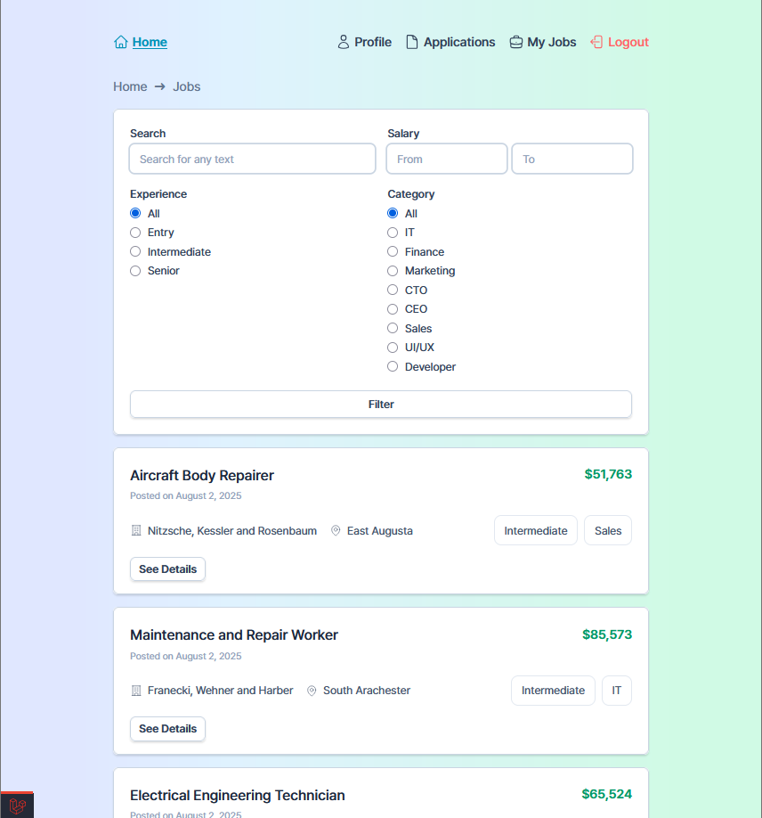
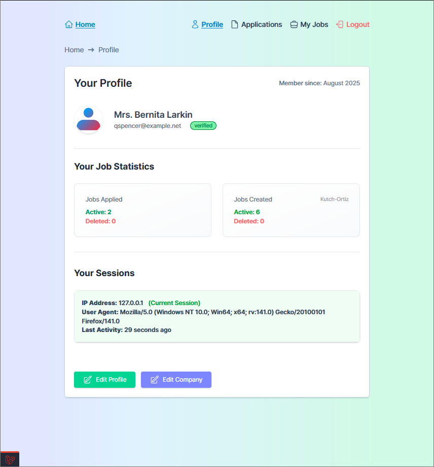
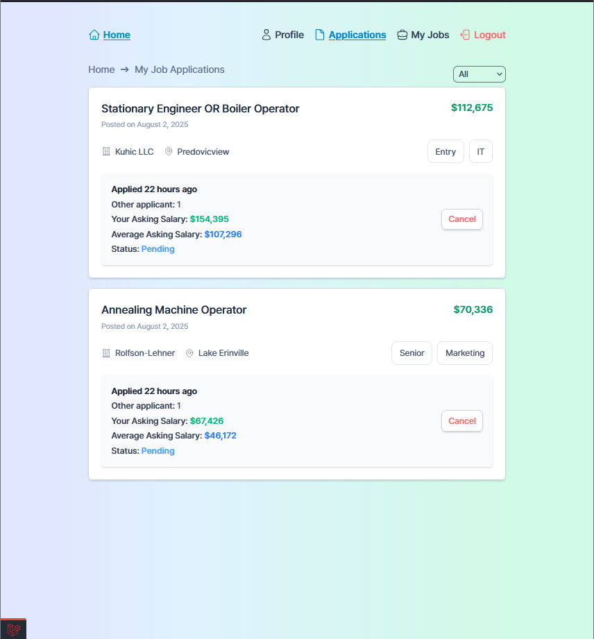
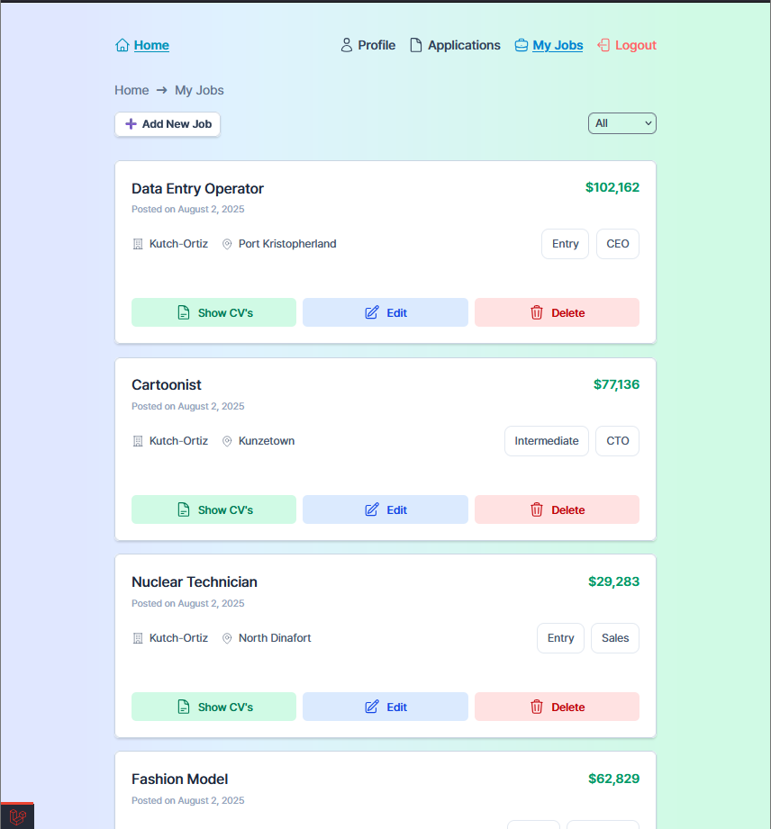
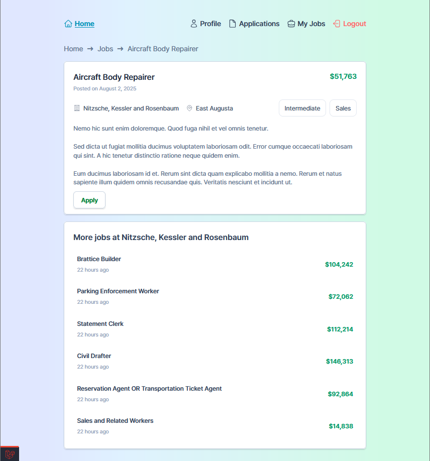
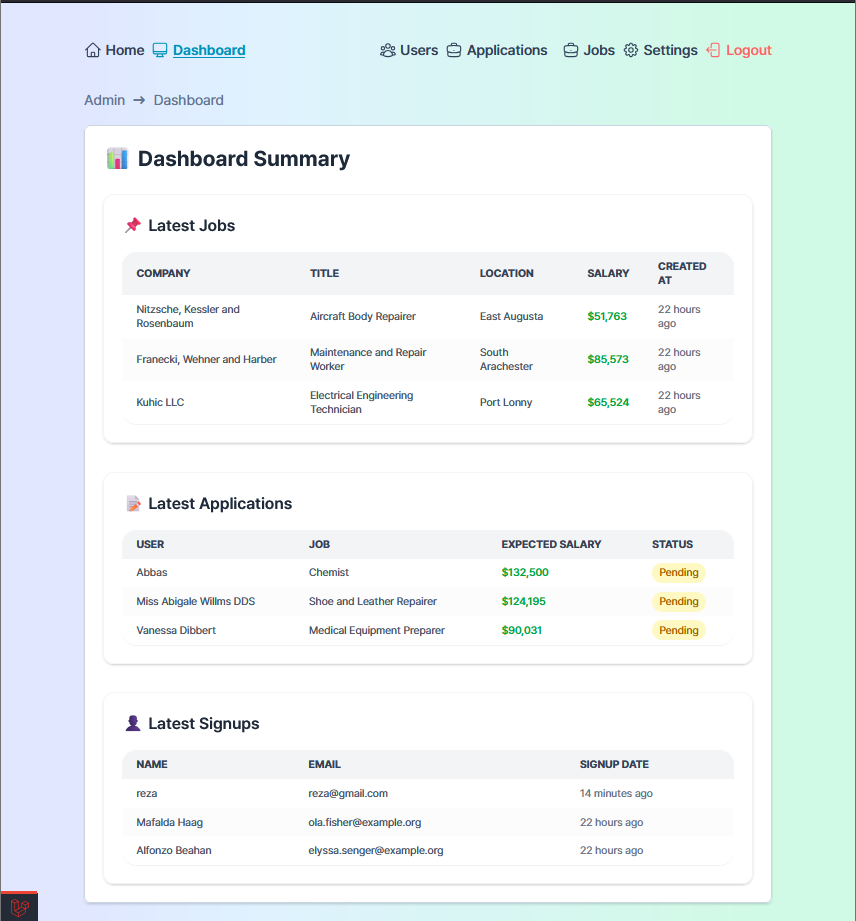
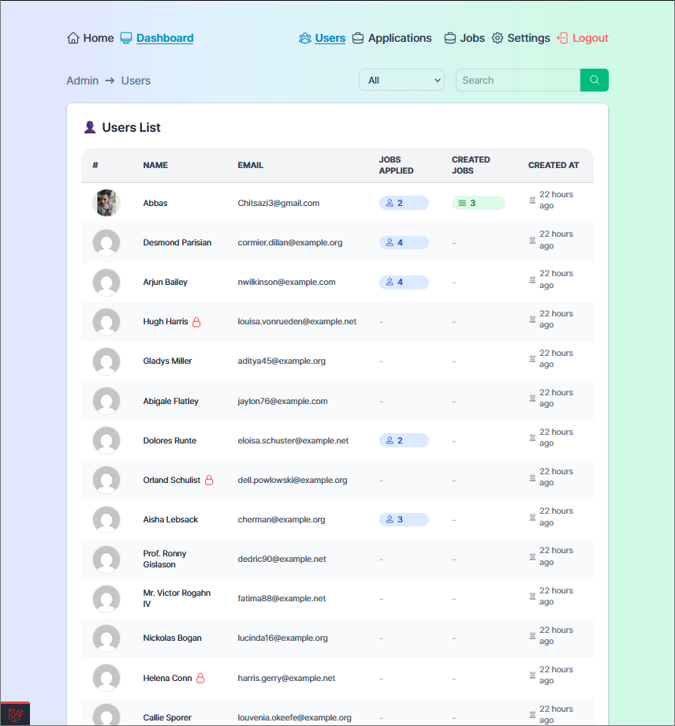
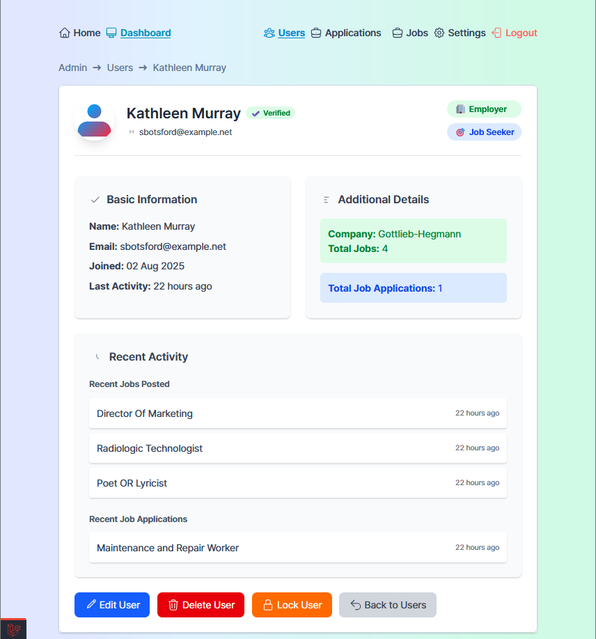
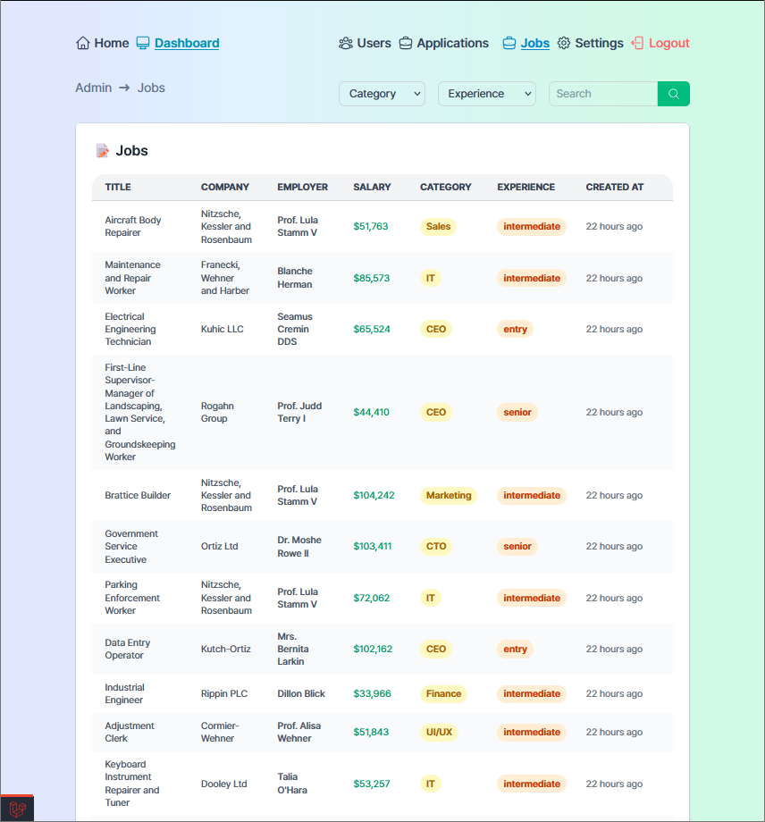
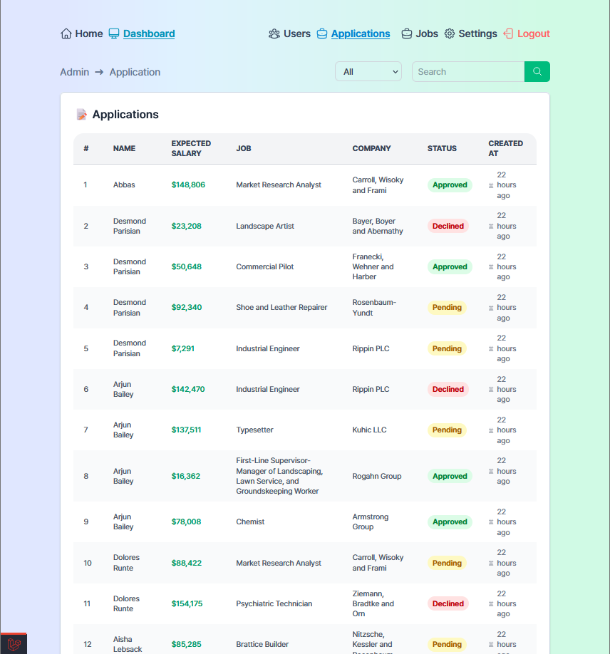

# Job Board - Laravel Application

A modern job board application built with Laravel that allows employers to post job opportunities and job seekers to apply for positions. Features role-based access control with admin panel.

## 🚀 Features

### For Job Seekers
- Browse and search jobs with advanced filtering
- Apply to jobs with CV upload
- Track application status
- User authentication and profile management

### For Employers
- Register as employer and post jobs
- Manage job postings (create, edit, delete)
- View and download applicant CVs
- Dashboard for job management

### For Admins
- User management (view, edit, delete, lock/unlock)
- Job application monitoring
- System settings management
- Dashboard with statistics

## 📸 Screenshots

### User Interface







### Admin Interface






## 🛠️ Technologies

- **Backend**: Laravel 12.0, PHP 8.2+, MySQL
- **Frontend**: Tailwind CSS 4.1, Alpine.js 3.14, Vite 7.0
- **Tools**: Laravel Debugbar, Laravel Pint, Faker

## 📋 Requirements

- PHP 8.2+
- Composer
- Node.js & npm
- MySQL

## 🚀 Installation

1. **Clone and setup**
   ```bash
   git clone https://github.com/AbasChitsazi/MicroJobBoard.git
   cd jobBoard
   composer install
   npm install
   ```

2. **Configure database**
   ```bash
   cp .env.example .env
   # Update database credentials in .env
   ```

3. **Setup application**
   ```bash
   php artisan key:generate
   php artisan migrate
   php artisan db:seed
   npm run build
   ```

4. **Start server**
   ```bash
   php artisan serve
   ```

## 🏗️ Project Structure

```
jobBoard/
├── app/
│   ├── Http/Controllers/     # Controllers (admin, auth, jobs)
│   ├── Models/              # Eloquent models
│   ├── Policies/            # Authorization policies
│   └── View/Components/     # Blade components
├── database/
│   ├── migrations/          # Database migrations
│   └── seeders/            # Database seeders
├── resources/views/         # Blade templates
└── routes/web.php          # Web routes
```

## 🗄️ Database Models

- **Users**: Authentication and user management
- **Employers**: Company information
- **Jobs**: Job postings with filtering
- **JobApplications**: Applications with CV uploads
- **VerifyCodes**: Email verification
- **PasswordResets**: Password reset functionality

## 🔧 Development

```bash
npm run dev
php artisan serve
```

## 📱 Key Features

### Job Management
- Advanced search and filtering
- CV upload/download
- Application tracking
- Soft deletes

### User Management
- Role-based access (admin, employer, jobseeker)
- User locking/unlocking
- Profile management
- Email verification

### Admin Panel
- User management dashboard
- Application monitoring
- System settings
- Statistics overview

## 📄 License

MIT License

## 🆘 Support

Contact: [abaschitsazii@gmail.com](mailto:abaschitsazii@gmail.com)
