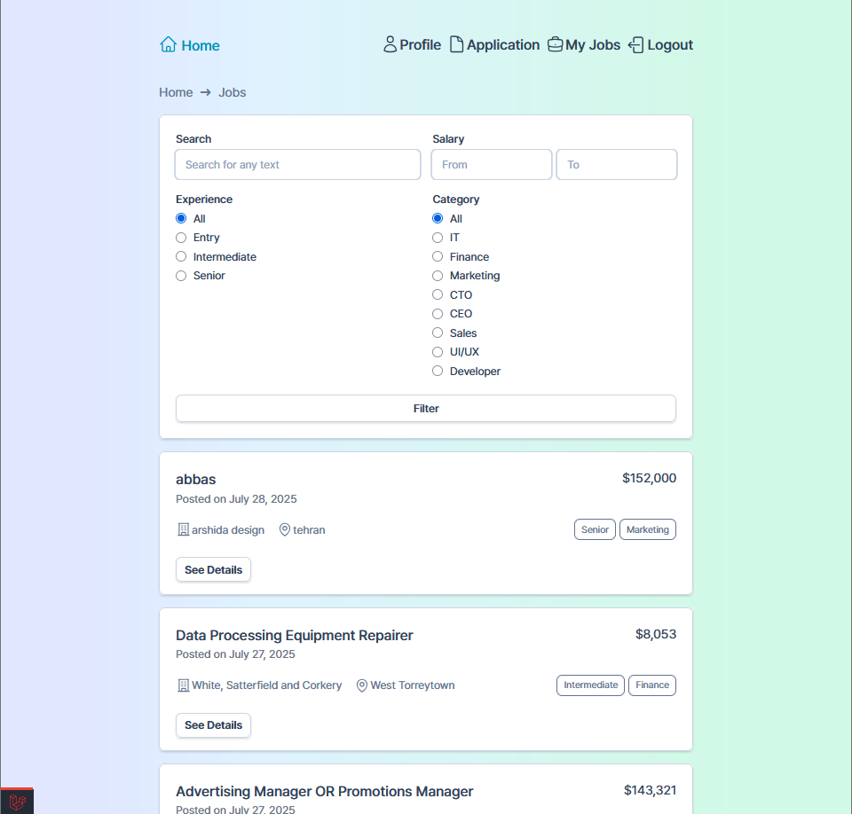
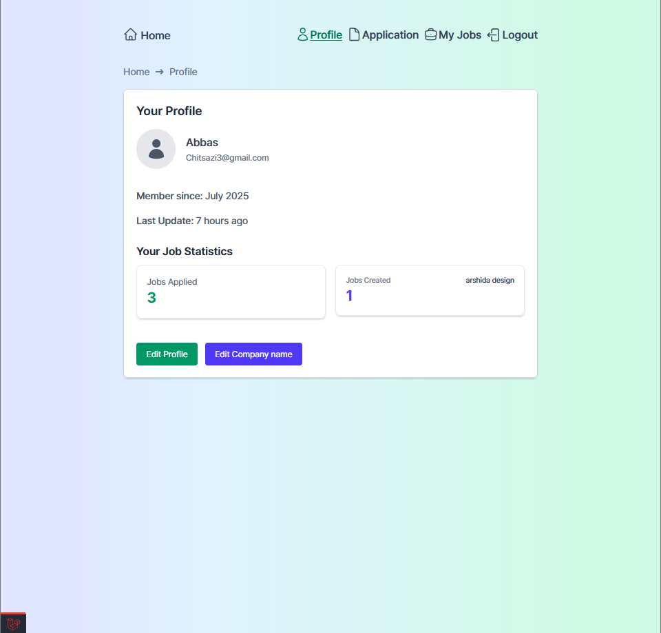
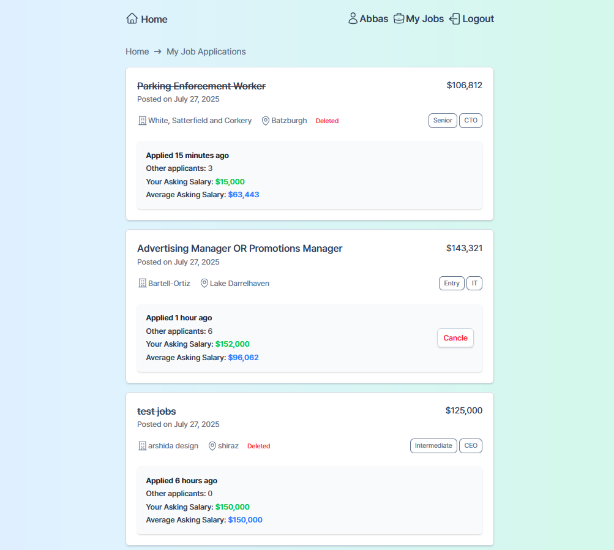
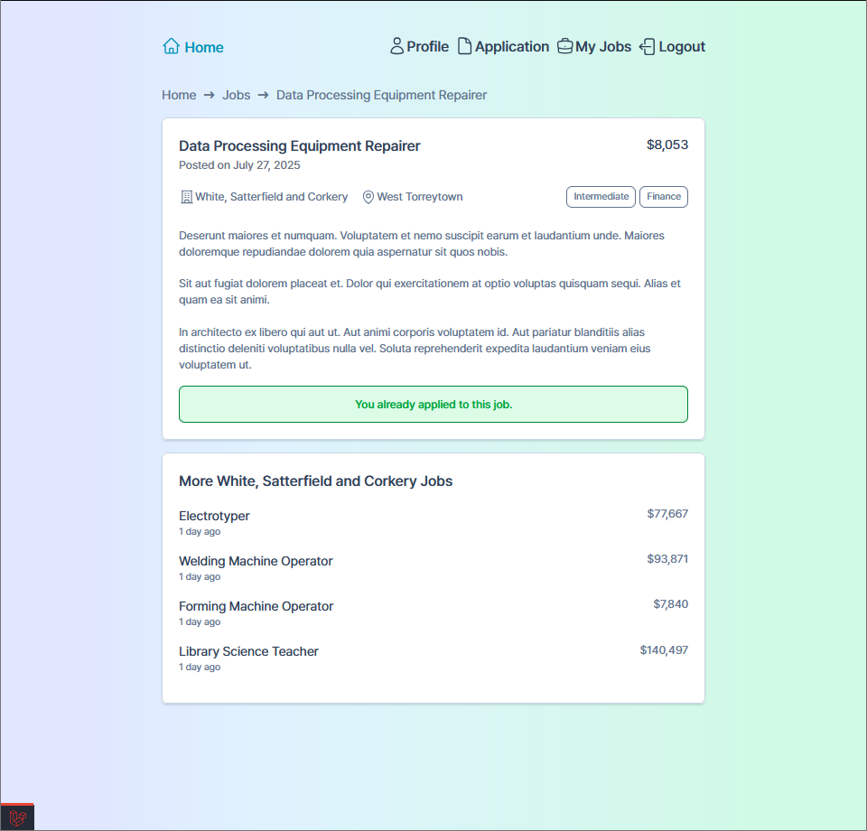

# Job Board - Laravel Application

A modern job board application built with Laravel that allows employers to post job opportunities and job seekers to apply for positions. The application features a clean, responsive interface with advanced filtering capabilities.

## 🚀 Features

### For Job Seekers
- **Browse Jobs**: View all available job postings with detailed information
- **Advanced Search & Filtering**: Filter jobs by salary range, experience level, category, and search terms
- **Job Applications**: Apply to jobs with expected salary and CV upload
- **Application Management**: Track all your job applications in one place
- **User Authentication**: Secure login/logout functionality

### For Employers
- **Employer Registration**: Register as an employer to post jobs
- **Job Management**: Create, edit, and manage job postings
- **Application Review**: View and download CV files from job applicants
- **Dashboard**: Manage all posted jobs from a centralized dashboard

### Technical Features
- **Responsive Design**: Modern UI built with Tailwind CSS
- **File Upload**: CV upload functionality for job applications
- **Soft Deletes**: Jobs can be soft deleted for data integrity
- **Authorization**: Role-based access control for employers


## 📸 Screenshots

### Home Page


### Profile Page


### Job Application Page


### My Jobs page


### Job Apply Page



## 🛠️ Technologies Used

### Backend
- **Laravel 12.0** - PHP web application framework
- **PHP 8.2+** - Server-side programming language
- **MySQL** - Database management system
- **Eloquent ORM** - Database abstraction layer

### Frontend
- **Tailwind CSS 4.1** - Utility-first CSS framework
- **Alpine.js 3.14** - Lightweight JavaScript framework
- **Vite 7.0** - Build tool and development server
- **Blade Templates** - Laravel's templating engine

### Development Tools
- **Laravel Debugbar** - Debugging and profiling
- **Laravel Pint** - PHP code style fixer
- **Faker** - Data generation for testing

## 📋 Prerequisites

- PHP 8.2 or higher
- Composer
- Node.js and npm
- Database (MySQL)

## 🚀 Installation

1. **Clone the repository**
   ```bash
   git clone <repository-url>
   cd jobBoard
   ```

2. **Install PHP dependencies**
   ```bash
   composer install
   ```

3. **Install Node.js dependencies**
   ```bash
   npm install
   ```

4. **Configure database**
   - Update your database credentials in `.env` file
   - Or use SQLite for development:
     ```bash
     touch database/database.sqlite
     ```

5. **Run migrations**
   ```bash
   php artisan migrate
   ```

5. **Seed database (optional)**
   ```bash
   php artisan db:seed
   ```

7. **Build assets**
   ```bash
   npm run build
   ```

8. **Start development server**
   ```bash
   php artisan serve
   ```

## 🏗️ Project Structure

```
jobBoard/
├── app/
│   ├── Http/
│   │   ├── Controllers/     # Application controllers
│   │   ├── Middleware/      # Custom middleware
│   │   └── Requests/        # Form request validation
│   ├── Models/              # Eloquent models
│   ├── Policies/            # Authorization policies
│   └── View/                # Blade components
├── database/
│   ├── factories/           # Model factories
│   ├── migrations/          # Database migrations
│   └── seeders/            # Database seeders
├── resources/
│   ├── css/                # Stylesheets
│   ├── js/                 # JavaScript files
│   └── views/              # Blade templates
└── routes/
    └── web.php             # Web routes
```

## 🗄️ Database Schema

### Core Models
- **Users**: Authentication and user management
- **Employers**: Company information and job posting capabilities
- **Jobs**: Job postings with filtering capabilities
- **JobApplications**: Job applications with CV uploads

### Key Relationships
- User has one Employer (optional)
- User has many JobApplications
- Employer has many Jobs
- Job has many JobApplications
- Job belongs to Employer

## 🎨 UI Components

The application uses a component-based architecture with reusable Blade components:
- **Layout**: Main application layout with navigation
- **Job Cards**: Display job information in cards
- **Forms**: Reusable form components with validation
- **Buttons**: Consistent button styling
- **Breadcrumbs**: Navigation breadcrumbs

## 🔧 Development

### Development Mode
```bash
npm run dev
php artisan serve
```

## 📱 Features in Detail

### Job Filtering
- Search by job title, description, or company name
- Filter by salary range (min/max)
- Filter by experience level (entry, intermediate, senior)
- Filter by job category (IT, Finance, Marketing, etc.)

### File Management
- CV upload during job application
- Secure file storage
- CV download for employers

### User Experience
- Responsive design for all devices
- Real-time form validation
- Success/error message handling
- Intuitive navigation

## 🤝 Contributing

1. Fork the repository
2. Create a feature branch
3. Make your changes
4. Add tests if applicable
5. Submit a pull request

## 📄 License

This project is open-sourced software licensed under the [MIT license](https://opensource.org/licenses/MIT).

## 🆘 Support

For support and questions, please open an issue in the repository or contact the development team [abaschitsazii@gmail.com](mailto:abaschotsazii@gmail.com).
